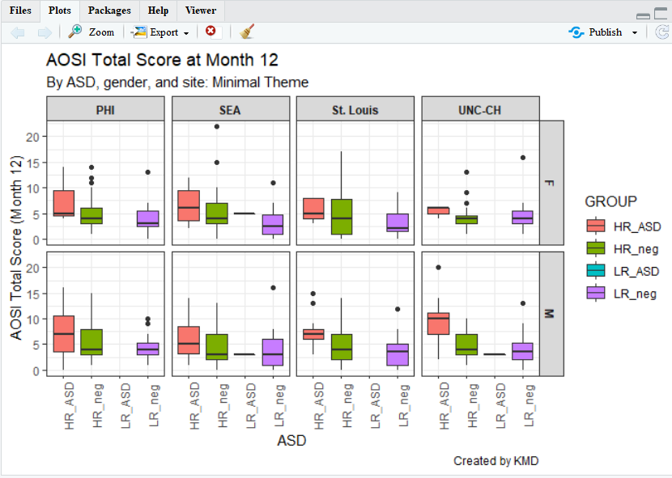

# Creating Graphs With ggplot2

```{r ch4_setup, include=FALSE}
knitr::opts_chunk$set(error = TRUE,
                      message = FALSE)
```

```{r ch4_load}
library(ggplot2)
```

## Base R vs. ggplot2
By default, R includes systems for constructing various types of plots.  Plotting with these built-in functions is referred to as using **Base R** in these tutorials.  While Base R can create many types of graphs that are of interest when doing data analysis, they are often not visually refined.  Futhermore, customizing your plot using Base R can be a convoluted process.  A package called **ggplot2** creates a separate system for plotting which generally results in visually pleasing graphs with extensive and easy-to-use customization features.  Thus, in these tutorials plotting with ggplot is covered and the Base R functions for plotting are discussed sparingly.

## ggplot2
### Introduction
**ggplot2** is a package for R and needs to be downloaded and installed once, and then loaded everytime you use R.  Like dplyr discussed in the previous chapter, ggplot2 is a set of new functions which expand R's capabilities along with an operator that allows you to connect these function together to create very concise code.  In dplyr, this operator was the pipe %>% and in ggplot this operator is +.  The guiding principle behind ggplot2 is that you build your plot from its foundational components (what dataset you are using, a template, etc.) to its more specific components (title, legend, etc.) and connect these components together using +.  You can think this as different layers placed on the same space which when placed on top of one another compose your plot.  The general structure of your ggplot code is the following:

ggplot(...) +
aesthetic(...) +
...

where the function ggplot2() is where you can specify the dataset, variables (x-axis and y-axis), groupings, colors, etc.to be used for all relevant layers in the plot.  The argument aesthetic(...) is replaced with the name of the function corresponding to the general way you would like your data to be shown.  Some examples include a scatterplot, smoothed line(s) of best fit, box and whisker, etc. where each of these types has their own function you would call in place of aesthetic(...).  Within this function's arguments, you would specify the parameters specific to this aesthetic/layer (dataset, x and y variables, groupings, etc.).  Thus, the arguments of ggplot() can be also left blank.  

Let's go through some simple examples to illustrate these two concepts.  Using the AOSI data, let's first create a scatterplot of AOSI total score at the 12 month visit by AOSI total score at the 6 month visit.  The function which displays the data as a scatterplot is called **geom_point()**.

```{r ggplot_ex_0}
aosi_data <- read.csv("Data/cross-sec_aosi.csv", stringsAsFactors=FALSE, na.strings = ".")

ggplot(data=aosi_data, aes(x=V06.aosi.total_score_1_18, y=V12.aosi.total_score_1_18))+
  geom_point()

ggplot()+
  geom_point(data=aosi_data, aes(x=V06.aosi.total_score_1_18, y=V12.aosi.total_score_1_18))
# same result produced; can specify plot parameters in general for all layers (1st example) or for the specific layer of interest.  Since only have one layer, both ways create the same plot.
```

Notice the use of aes(x=..., y=...) and not just x=..., y=....  When specifying dataset variables as values for your plotting paramaters, you must surround these arguments in aes() so that ggplot2 knows these names refer to dataset variable names.  Note also how specifying the plotting parameter values inside ggplot() and inside geom_point() resulted in the same plot.  You can specify plot parameters in general for all layers (inside ggplot()) or for the specific layer of interest (in this case, inside geom_point()).  Since you only have one layer, both ways create the same plot.

## ggplot Aesthetics
A scatterplot with geom_point() is just one example of the aesthetics available with ggplot.  Let's go through a few other ones that you will likely be using when analyzing IBIS data.  You will see that many of the discussed customization options are available for all of these aesthetics, however they have effects which differ across the aesthetics.

### Scatterplot
We have already introduced the scatterplot, so let's dive into customization.  Suppose I wish to color the points with something other then black; let's use blue.

```{r ggplot_ex_1}

ggplot(data=aosi_data, aes(x=V06.aosi.total_score_1_18, y=V12.aosi.total_score_1_18), color="blue")+
  geom_point()

# does not work, still black.  Why?  

ggplot()+
  geom_point(data=aosi_data, aes(x=V06.aosi.total_score_1_18, y=V12.aosi.total_score_1_18), color = "blue")
```

First, notice that since "blue" does not refer to a variable in the AOSI dataset, this plotting parameter is placed **outside** of aes().  Also, notice that placing color="blue" in ggplot() did not work while placing it inside of the aesthetic geom_point() did.  This is because the ggplot function only accepts arguments of the form data= and aes(...).  Parameter values which do not refer to variables in the dataset can not be placed in ggplot() and must be placed in the specific layer(s) of interest.

Suppose instead that we want to color the points based on the value of another value in the dataset such as ADS diagnosis.  To do this, we follow the structure discussed above with the following code.

```{r ggplot_ex_2}

ggplot(data=aosi_data, aes(x=V06.aosi.total_score_1_18, y=V12.aosi.total_score_1_18, color=GROUP))+
  geom_point()  

ggplot()+
  geom_point(data=aosi_data, aes(x=V06.aosi.total_score_1_18, y=V12.aosi.total_score_1_18, color = GROUP))
```

Notice how both commands create the same plot.  Why? (refer to explanation before with "blue")  Notice also that a legend is automaticaly created.  This legend can be heavily customized, which is discussed later in this chapter.

You can specify more plotting parameters in this simple example, such as size, shape and many more.  We will cover size and shape, but for all aesthetics, you should take a look at the documentation for that aesthetic's function (ex., geom_point()) and experiment.  Size and shape work similarly to color; you can specify fixed values for all points or have the values vary depending on another variable.  You also specify any combination of these plotting parameters in your code.

```{r ggplot_ex_2_1}

# size only
ggplot(data=aosi_data, aes(x=V06.aosi.total_score_1_18, y=V12.aosi.total_score_1_18, size=GROUP))+
  geom_point()

# shape only
ggplot()+
  geom_point(data=aosi_data, aes(x=V06.aosi.total_score_1_18, y=V12.aosi.total_score_1_18, shape = GROUP))

# Size and color
ggplot()+
  geom_point(data=aosi_data, aes(x=V06.aosi.total_score_1_18, y=V12.aosi.total_score_1_18, color=GROUP, size=Gender))

# Shape and color
ggplot()+
  geom_point(data=aosi_data, aes(x=V06.aosi.total_score_1_18, y=V12.aosi.total_score_1_18, color=GROUP, shape=Gender))
```

The above examples all have size and shape vary with a variable, but you can also use fixed values like what was done for color.  You use numbers to refer to different sizes and shapes; for a comprehensive view on all of the different plotting parameters you can set **for each aesthetic** and which values corresponding to which visual, see [the following ggplot2 documentation page](https://ggplot2.tidyverse.org/articles/ggplot2-specs.html#point).

### Colors in R
Following the past example, let's discuss how to refer to colors in R.  Namely, R needs to understand that when you specify "blue" in the color parameter, you are referring to a color and not just a string of letters.  Colors in R are actually referenced by special strings of a few letters and numbers which R translates to represent a specific color in its library of colors.  By default, R has a set of colors it can display with corresponding codes.  For example, the string "#0000FF" is recognized by R as dark blue.  This library of colors can be expanded (see package **ColorBrewer**), but geenrally the default set is enough.  In many functions, such as ggplot(), you can specify a color using its actual English name as a string (as was done in the example above with "blue") since it is assumed that you would only be specifying a specific color and not simply the word "blue".  You may never need to use the actual color codes, but if you notice an error occuring when specifying a color, try to replace its name in the function code with the correspnding color code.  The names and codes for specifc colors can be easily found online through a Google search.

### Line of best fit
It is often of interest to visualize your data using a line of best fit or some other "smoother" in order to better illustrate patterns between specific variables.  This can be done using **geom_smooth()**. It's arguments are structured just like with geom_point(), including the use of aes().  Note that this structure is the same for all aesthetics, although certain parameters are exclusive to specific aesthetics due to their inherent differences in visualizing the data of interest. Note that different smoothing methods can be specified.  The two most common are a linear smoother (line of best fit/regression line) and using LOESS (a non-linear smoother) but there are other then can be specified.  Let's use the AOSI total score example shown before, but plot a smooth line constructed from the data instead of a scatterplot.

```{r ggplot_ex_3}

ggplot(data=aosi_data, aes(x=V06.aosi.total_score_1_18, y=V12.aosi.total_score_1_18))+
  geom_smooth(method="lm")

ggplot(data=aosi_data, aes(x=V06.aosi.total_score_1_18, y=V12.aosi.total_score_1_18))+
  geom_smooth(method="loess") # loess is default and will automatically be used if method is not specified

```

Notice that error bars for the smoother are also provided by default, reflected by the gray shading around the line.  These can be turned off as well (add argument se=FALSE to geom_smooth()).

While this visual is nice, we often want a scatterplot and line on best fit on the same plot.  This can done with ggplot by recalling its layered structure when creating the plot.  Imagine the scatterplot as one layer and the smoothed line plot as another layer; we wish to paste them together with the smoothed line on top.  This done using the + operator, as shown below.  Note that the gray error bars in the smoothed line have a measure of transparency (which can also be adjusted), so the scatterplot points will still be visible.

```{r ggplot_ex_4}

ggplot(data=aosi_data, aes(x=V06.aosi.total_score_1_18, y=V12.aosi.total_score_1_18))+
  geom_point()+
  geom_smooth(method="lm")

ggplot(data=aosi_data, aes(x=V06.aosi.total_score_1_18, y=V12.aosi.total_score_1_18))+
  geom_point()+
  geom_smooth(method="loess")

```

What happens when you switch the order of the layers in the code?  This idea of stacking layers and building the plot component-by-component forms the skeleton of gglot's functionality.  We will see this more when we discuss titles, subtitles, etc. 

The plotting parameters for geom_smooth include color and size from before, as well as method as shown in the above example.  A few other handy parameters are **linetype** and **group**; linetype allows you to change the aesthetics of the smoothed trend line and group allows you to create a separate trend line for each value of a chosen variable.  See below for an example of using group.

```{r ggplot_ex_4_1}
ggplot(data=aosi_data, aes(x=V06.aosi.total_score_1_18, y=V12.aosi.total_score_1_18))+
  geom_point(aes(color=Gender))+
  geom_smooth(method="lm", aes(group=Gender))
# Notice the color of the line of best fit did not change with the groups, why?

ggplot(data=aosi_data, aes(x=V06.aosi.total_score_1_18, y=V12.aosi.total_score_1_18))+
  geom_point(aes(color=Gender))+
  geom_smooth(method="lm", aes(group=Gender, color=Gender))
# Much more clear!

```

### Box and whisker
While the examples above are aesthetics that simply change how the raw data is displayed, now we consider aesthetics that represent the data in a different way by applying some statistical transformation.  One example is a box and whisker, or just boxplot, which calculates an estimate of the distribution of the data (median, percentiles, etc.) and then visualizes this distribution.  A boxplot can be created using the function geom_boxplot().  Consider the following boxplot example visualizing the distribution of AOSI total score at 12 months for each ASD diagnosis group.

```{r ggplot_ex_5}

ggplot(data=aosi_data, aes(x=GROUP, y=V12.aosi.total_score_1_18))+
  geom_boxplot()

ggplot(data=aosi_data, aes(y=GROUP, x=V12.aosi.total_score_1_18))+
  geom_boxplot()
# Does not create the plot of interest; x needs to be grouping variable and y needs to be the 
# continuous variable of interest.  We will a see way later to switch the two axes appropriately.
```

You should experiment with all of the different parameters available for each aesthetic and see how the resulting plot changes.  Here, we also color the boxes by ASD diagnosis group to further highlight them in the plot.  Notice that color only changes the border and lines of the boxplot while fill changes the white space of the boxplot.  What happens if you specify both of these in the same plot?  

We can also use the color/fill parameter here to have an additional variable used to group the data.  Do not use the group plotting parameters with boxplot (see example below).

```{r ggplot_ex_6}

ggplot(data=aosi_data, aes(x=GROUP, y=V12.aosi.total_score_1_18, fill=GROUP))+
  geom_boxplot()

ggplot(data=aosi_data, aes(x=GROUP, y=V12.aosi.total_score_1_18, color=GROUP))+
  geom_boxplot()

ggplot(data=aosi_data, aes(x=GROUP, y=V12.aosi.total_score_1_18, color=Gender))+
  geom_boxplot()

ggplot(data=aosi_data, aes(x=GROUP, y=V12.aosi.total_score_1_18, fill=Gender))+
  geom_boxplot()

ggplot(data=aosi_data, aes(x=GROUP, y=V12.aosi.total_score_1_18, group=Gender))+
  geom_boxplot()
ggplot(data=aosi_data, aes(x=Gender, y=V12.aosi.total_score_1_18, group=Gender))+
  geom_boxplot()
# Notice that these last 2 plots are the same; using group=Gender with x=GROUP in the 5th example caused Gender to override x=GROUP when calculating the bxoplots, but due to x=GROUP the x-axis was labeled by GROUP and not gender
```

### Barchart
Suppose you want to create a bar chart with frequency counts for a cateogrical variable.  Again, the data have to be transformed, this time to a dataset of the frequency counts and/or percentages and then visualized.  The aesthetic geom_bar() creates a bar chart.  See an example below with ASD diagnosis.

```{r ggplot_ex_7}
ggplot(data=aosi_data, aes(x=GROUP))+
  geom_bar()
```

While you may want to visualize frequency counts, you may also want to create a similar plot but using a different statistic.  This highlights a useful feature with ggplot; every aesthetic also has a stat argument, along with a default value for this argument.  Thus, you can specify the statistical transformation done to your data to be plotted using this stat argument.  For geom_point(), the default stat value is "identity" and for geom_bar() the default value is "count".  Thus, you often will not have to specify this argument.  These different statistical transformations are omitted in these tutorials, however those interested should read [R for Data Science](https://r4ds.had.co.nz/) by Hadley Wickham for more information and some examples.  The one example that is covered here is plotting frequency percentages instead of counts.  This is done by specifying y=..prop.. and a value for the argument group in the geom_bar() function.  See the ASD diagnoses by AOSI total score example below.

```{r ggplot_ex_8}
ggplot(data=aosi_data, aes(x=GROUP))+
  geom_bar(aes(y=..prop.., group=1))

ggplot(data=aosi_data, aes(x=GROUP))+
  geom_bar(aes(y=..prop.., group=GROUP))

```

When plotting the frequency percentages (or proportions), we are essentially changing the calculated variable used on the y axis from count to percentage.  This is done by specifying y=..prop..; R understands ..prop.. to mean "calculate frequency proportion" even though this variable is not in the dataset.  We also need to tell R how to calculate the proportion in each x value; i.e., specify the "denominator".  To compare to the whole sample, use group=1.  As a silly example for illustration purpose, notice what happens when group=GROUP (recall GROUP is the ASD diagnosis variable) is specified.  Why did this occur?

Since we have seen many examples of using the various plotting parameters, try the ones discussed as well as the ones detailed in the [ggplot2 documentation](https://ggplot2.tidyverse.org/articles/ggplot2-specs.html#point).  How do these behave with barcharts compared to the other aesthetics discussed above?

### Other aesthetics
There are many other ggplot2 aesthetics that are available for you to choose from.  You can find detail on these additional aesthetics at [ggplot2's website](https://ggplot2.tidyverse.org/), however the examples above are likely what you will be using when doing data analysis.  You also now have enough knowledge to go out and learn how to use these other aesthetics yourself.

## Additional customization
So far all of our ggplot2 code has been fairly simple, generally of the form

ggplot2(...)+
  aethestic_1(...)+
  aesthetic_2(...)
  
Of course we could keep piling on aesthetics, but we want to add elements to our code that further refine our plot to have as much control as is needed to create the optimal visual representation of the data.  To do this, we can add layers to our ggplot code which will adjust all of the elements of the plot we want to change, and leave the others as default by not referencing them.  In general your ggplot code will have the form

ggplot2(...)+
  aethestic_1(...)+
  aesthetic_2(...)+
  element_1(...)+
  element_2(...)+ 
  ...
  
where you likely will have one or two aesthetics and many elements.  Let's go through some common elements you will use, motivated by the following basic plot created before.

```{r ggplot_ex_9}
ggplot(data=aosi_data, aes(x=GROUP, y=V12.aosi.total_score_1_18, fill=Gender))+
  geom_boxplot()
```

### Titles and Labels
First, we need a title for this plot.  The titles (main title, subtitle, caption, etc.) for your plot can specified using **labs()**.  Since labs() is just an element of your plot, just add on +labs(...) to your code; this format is how all elements are added.  Then within labs(), specify the values for the arguments corresponding to the types of titles you would like to modify; main title (title=...), subtitle (subtitle=...), caption (caption=...), legend title (fill=...), etc.  See the example below.

```{r ggplot_ex_10}
ggplot(data=aosi_data, aes(x=GROUP, y=V12.aosi.total_score_1_18, fill=Gender))+
  geom_boxplot()+
  labs(title="AOSI Total Score at Month 12", subtitle="By ASD and gender", 
       fill="Child's Gender", caption="Created by KMD")
```

Looking much better, but let's also clean up these convoluted axis labels.  By default, R takes the variable name to be the corresponding axis label; sometimes this works, but often it does not look very clean.  The axis labels are actually just additional arguments to the labs() function, namely x= and y=.

```{r ggplot_ex_11}
ggplot(data=aosi_data, aes(x=GROUP, y=V12.aosi.total_score_1_18, fill=Gender))+
  geom_boxplot()+
  labs(title="AOSI Total Score at Month 12", subtitle="By ASD and gender", caption="Created by KMD", x="ASD", y="AOSI Total Score (Month 12)")
```

### Colors
We can also change the colors used for the fill color, specifically which colors map to which value of gender.  Again, R has default values, generally red for a variable of one level, red and blue for a variable of two levels (as seen here), red, blue, and green for a variable of three levels, etc.  While the default often works fine, you may want to manually set these colors, specifically if red and green are used together (people who are colorblind will have trouble reading your plot).  Note that here we are discussing the case where the variable is categorical, however you can also apply colorings to a continuous variable (see the example below).  For categorical colorings, use the element scale_color_manual() (and for a continuous color scale use scale_color_gradient() and the associated variations).

```{r ggplot_ex_12}
# continuous color scale plot
ggplot(data=aosi_data, aes(x=GROUP, y=V12.aosi.total_score_1_18, color=V12.aosi.total_score_1_18))+
  geom_point()+
  labs(title="AOSI Total Score at Month 12, colored by AOSI Total Score at Month 12", subtitle="By ASD", caption="Created by KMD", x="ASD", y="AOSI Total Score (Month 12)")

# default color is hard to see

# change color scale, see documentation about scale_color_gradient() to see how it works
ggplot(data=aosi_data, aes(x=GROUP, y=V12.aosi.total_score_1_18, color=V12.aosi.total_score_1_18))+
  geom_point()+
  labs(title="AOSI Total Score at Month 12, colored by AOSI Total Score at Month 12", subtitle="By ASD", caption="Created by KMD", x="ASD", y="AOSI Total Score (Month 12)")+
  scale_color_gradient(low="blue",high="red")
```

### Sizes and shapes
For scatterplots, you can also change the sizes of the points as well as their shapes using the size and shape arguments respectively.  These function just like color; please see below for an example with shape to distinguish the ASD diagnoses and increasing the size of the data points to better illustrate the shapes.

```{r ggplot_ex_shape}
# continuous color scale plot
ggplot(data=aosi_data, aes(x=V06.aosi.total_score_1_18, y=V12.aosi.total_score_1_18, shape=GROUP))+
  geom_point(size=3)+
  labs(title="AOSI Total Score at Month 12 and AOSI Total Score at Month 6", subtitle="By ASD", caption="Created by KMD", x="ASD", y="AOSI Total Score (Month 12)")
```

### Themes
Most of the other components of your plot can customized using the **theme()** function in ggplot2.  Themes serve two purposes
1) Change the general look of the plot (can be thought of like changing the visual template of your plot)
2) Fine tune all of the specific visual elements of the plot (including titles, labels, legends, etc.)

Some elements that we have already discussed, such as titles and axis labels, can also be customized using theme().  Each argument of the function specifies a different piece of the plot to customize; if the argument is not specified, the default value is used automatically.

All plots created using ggplot2 have a default theme that is used.  You can see the gray background and vertical and horizontal grid lines included in all of the plots created thus far.  This default theme can be changed by calling the function related to the theme of interest.  Then, you can customize this chosen theme ever further by using the theme() function.  

For some examples of this, let's work with the AOSI Total Score at month 12 boxplot example from before.  Recall, without changing the theme, the plot was the following.

```{r ggplot_theme_1}
ggplot(data=aosi_data, aes(x=GROUP, y=V12.aosi.total_score_1_18, fill=Gender))+
  geom_boxplot()+
  labs(title="AOSI Total Score at Month 12", subtitle="By ASD and gender", caption="Created by KMD", x="ASD", y="AOSI Total Score (Month 12)")
```

First, let's change the theme to theme_bw ("bw" stands for "black and white").  We specify this theme by including its associated function call, which is **theme_bw()**.

```{r ggplot_theme_2}
ggplot(data=aosi_data, aes(x=GROUP, y=V12.aosi.total_score_1_18, fill=Gender))+
  geom_boxplot()+
  theme_bw()+
  labs(title="AOSI Total Score at Month 12", subtitle="By ASD and gender", caption="Created by KMD", x="ASD", y="AOSI Total Score (Month 12)")
```

Notice that we connect the theme_bw() function call to the rest of the code using +.  This is because a theme can be thought of as an element of the plot, so we use + to connect it to the rest of the components specified in the plot's code.  Now, we can see the gray background has been replaced with a white background, te grid lines are now light gray, and the plot axes are marked by a black line.  There are other themes you can use, as shown below.

```{r ggplot_theme_3}
ggplot(data=aosi_data, aes(x=GROUP, y=V12.aosi.total_score_1_18, fill=Gender))+
  geom_boxplot()+
  theme_minimal()+
  labs(title="AOSI Total Score at Month 12", subtitle="By ASD and gender: Minimal Theme", caption="Created by KMD", x="ASD", y="AOSI Total Score (Month 12)")

ggplot(data=aosi_data, aes(x=GROUP, y=V12.aosi.total_score_1_18, fill=Gender))+
  geom_boxplot()+
  theme_classic()+
  labs(title="AOSI Total Score at Month 12", subtitle="By ASD and gender: Classic Theme", caption="Created by KMD", x="ASD", y="AOSI Total Score (Month 12)")
```

For a more complete list of available themes, see https://ggplot2.tidyverse.org/reference/ggtheme.html, though there are many more available though various R packages.

After choosing the theme (or leaving the default gray background theme), you can fine tune specific elements of the plot using theme() and specifying its element using a different argument in the function.  For a complete list of components you can customize, please see https://ggplot2.tidyverse.org/reference/theme.html.  We will customize the legend as an example of using this function.

You can see from the above plot that by default, the legend is located to the right of the plot and the legend title's font is basic text.  Let's alter these components using theme().  We will move the legend to the bottom of the plot and bold and enlarge the legend's title.  This is done using the arguments **legend.position** and **legend.title** respectively.

```{r ggplot_theme_4}
ggplot(data=aosi_data, aes(x=GROUP, y=V12.aosi.total_score_1_18, fill=Gender))+
  geom_boxplot()+
  theme_bw()+
  theme(legend.position = "bottom", 
        legend.title = element_text(face="bold", size=20))+
  labs(title="AOSI Total Score at Month 12", subtitle="By ASD and gender: Minimal Theme", caption="Created by KMD", x="ASD", y="AOSI Total Score (Month 12)")
```

We can also bold and enlarge the text defining the color labels in the legend using legend.text() and change the sisze of the symbols in the legend using legend.key.size().

```{r ggplot_theme_5}
ggplot(data=aosi_data, aes(x=GROUP, y=V12.aosi.total_score_1_18, fill=Gender))+
  geom_boxplot()+
  theme_bw()+
  theme(legend.position = "bottom", 
        legend.title = element_text(face="bold", size=20),
        legend.text = element_text(face="bold", size=20),
        legend.key.size=unit(15,"mm"))+
  labs(title="AOSI Total Score at Month 12", subtitle="By ASD and gender: Minimal Theme", caption="Created by KMD", x="ASD", y="AOSI Total Score (Month 12)")
```

To alter the plot title's text (size, font, bold, itallic, etc.) you would use the argument **plot.title** in the same fashion.  Note that we had to use the **element_text()** function to specify these font characteristics; this must be done when using the theme() function to adjust proporties of any text in the plot.  Notice also that the function **units()** had to be used when changing the size of the legend symbols.  Use ?units to see what units are available to specify; milimeters (mm) was used here.

```{r ggplot_theme_6}
ggplot(data=aosi_data, aes(x=GROUP, y=V12.aosi.total_score_1_18, fill=Gender))+
  geom_boxplot()+
  theme_bw()+
  theme(legend.position = "bottom", 
        legend.title = element_text(face="bold", size=15),
        plot.title = element_text(face="bold", size=20))+
  labs(title="AOSI Total Score at Month 12", subtitle="By ASD and gender: Minimal Theme", caption="Created by KMD", x="ASD", y="AOSI Total Score (Month 12)")
```

### Reversing the axes
You can also flip the x and y axes of your plot using coord_flip().  Note that even after you use coord_flip(), all the other arguments for your plot wich reference the specific axes (x=, y=, etc.) will still **refer to original orientation of the plot** (i.e., before the flip).

```{r ggplot_theme_7}
ggplot(data=aosi_data, aes(x=GROUP, y=V12.aosi.total_score_1_18, fill=Gender))+
  geom_boxplot()+
  theme_bw()+
  theme(legend.position = "bottom", 
        legend.title = element_text(face="bold", size=15),
        plot.title = element_text(face="bold", size=20))+
  labs(title="AOSI Total Score at Month 12", subtitle="By ASD and gender: Minimal Theme", caption="Created by KMD", x="ASD", y="AOSI Total Score (Month 12)")+
  coord_flip()
```

### Facets
The last piece of customization that is covered is faceting.  This allows you to group your plot into sub-plots based on one or more grouping variables.  This is best explained by example.  Consider the above boxplot.  Let's visualize the same information, but using faceting.

```{r ggplot_facet_1}
ggplot(data=aosi_data, aes(x=GROUP, y=V12.aosi.total_score_1_18, fill=GROUP))+
  geom_boxplot()+
  theme_bw()+
  facet_wrap(~Gender)+
  labs(title="AOSI Total Score at Month 12", subtitle="By ASD, gender, and site: Minimal Theme", caption="Created by KMD", x="ASD", y="AOSI Total Score (Month 12)")
```

We can also use two grouping variables; let's use study site as a second grouping to create pairwise comparisons.

```{r ggplot_facet_2}
ggplot(data=aosi_data, aes(x=GROUP, y=V12.aosi.total_score_1_18, fill=GROUP))+
  geom_boxplot()+
  theme_bw()+
  facet_grid(Gender~Study_Site)+
  labs(title="AOSI Total Score at Month 12", subtitle="By ASD, gender, and site: Minimal Theme", caption="Created by KMD", x="ASD", y="AOSI Total Score (Month 12)")
```

Notice that the x-axis labels overlap; we can fix this using theme() by rotating the x-axis label text using the argument **axis.text.x**.

```{r ggplot_facet_3}
ggplot(data=aosi_data, aes(x=GROUP, y=V12.aosi.total_score_1_18, fill=GROUP))+
  geom_boxplot()+
  theme_bw()+
  facet_grid(Gender~Study_Site)+
  theme(axis.text.x=element_text(angle = 90))+
  labs(title="AOSI Total Score at Month 12", subtitle="By ASD, gender, and site: Minimal Theme", caption="Created by KMD", x="ASD", y="AOSI Total Score (Month 12)")
```

Or we could remove the axis labels entirely using **element_blank()** and rely on the legend colors.  We can similarly remove the axis tick marks as well.  The function element_blank() can be used with the theme() function in this fashion to remove specific components of the plot.

```{r ggplot_facet_4}
ggplot(data=aosi_data, aes(x=GROUP, y=V12.aosi.total_score_1_18, fill=GROUP))+
  geom_boxplot()+
  theme_bw()+
  facet_grid(Gender~Study_Site)+
  theme(axis.text.x=element_blank(),
        axis.ticks.x=element_blank())+
  labs(title="AOSI Total Score at Month 12", subtitle="By ASD, gender, and site: Minimal Theme", caption="Created by KMD", x="ASD", y="AOSI Total Score (Month 12)")
```

Let's get back to faceting.  As seen in the above examples, it can be implemented using **facet_wrap()** or **facet_grid()**.  Both functions have the same structure when being called; specify the grouping variables x and y using **y~x** inside the function.  First, let's discuss facet_wrap() which is recommended when you have only one grouping variable.  It allows the sub-plots to "wrap" to the next row or column instead of being forced to all be on a single dimension.  When using facet_wrap() with grouping variable y, make sure to specify **~y** or **y~.**and not **y~** (which generates an error).  Using study site as the grouping variable, you can see the sub-plots wrap around to the next row.  If you want to specify the layout of the sub-plots yourself, you can use the **nrow** and **ncol** to force the number of rows and columns respectively.

```{r ggplot_facet_5}
ggplot(data=aosi_data, aes(x=GROUP, y=V12.aosi.total_score_1_18, fill=GROUP))+
  geom_boxplot()+
  theme_bw()+
  facet_wrap(~Study_Site)+
  labs(title="AOSI Total Score at Month 12", subtitle="By ASD, gender, and site: Minimal Theme", caption="Created by KMD", x="ASD", y="AOSI Total Score (Month 12)")

ggplot(data=aosi_data, aes(x=GROUP, y=V12.aosi.total_score_1_18, fill=GROUP))+
  geom_boxplot()+
  theme_bw()+
  facet_wrap(Study_Site~.)+
  labs(title="AOSI Total Score at Month 12", subtitle="By ASD, gender, and site: Minimal Theme", caption="Created by KMD", x="ASD", y="AOSI Total Score (Month 12)")
```

To arrange your sub-plots in a strict grid, use facet_grid().  With one variable, this essentially forces the sub-plots into a single dimension and thus is a more limited version of facet_wrap.  With two grouping variables, this function arranges the sub-plots in a two dimensional grid as seen below.  Note that when using y~x, y specifies the row variable and x the column variable.

```{r ggplot_facet_6}
ggplot(data=aosi_data, aes(x=GROUP, y=V12.aosi.total_score_1_18, fill=GROUP))+
  geom_boxplot()+
  theme_bw()+
  facet_grid(Gender~Study_Site)+
  theme(axis.text.x=element_text(angle = 90))+
  labs(title="AOSI Total Score at Month 12", subtitle="By ASD, gender, and site: Minimal Theme", caption="Created by KMD", x="ASD", y="AOSI Total Score (Month 12)")

ggplot(data=aosi_data, aes(x=GROUP, y=V12.aosi.total_score_1_18, fill=GROUP))+
  geom_boxplot()+
  theme_bw()+
  facet_grid(Study_Site~Gender)+
  theme(axis.text.x=element_text(angle = 90))+
  labs(title="AOSI Total Score at Month 12", subtitle="By ASD, gender, and site: Minimal Theme", caption="Created by KMD", x="ASD", y="AOSI Total Score (Month 12)")
```

There are many options you can adjust with your facets, which is done using the theme() function.  The arguments starting with "strip" refer to components of the facets, and they operate just like the other arguments of theme() do.  For example, we could bold both the row and column facet labels as done below using **strip.text**.  Again, see ?theme for the various options you can adjust.

```{r ggplot_facet_7}
ggplot(data=aosi_data, aes(x=GROUP, y=V12.aosi.total_score_1_18, fill=GROUP))+
  geom_boxplot()+
  theme_bw()+
  facet_grid(Gender~Study_Site)+
  theme(axis.text.x=element_text(angle = 90),
        strip.text=element_text(face="bold"))+
  labs(title="AOSI Total Score at Month 12", subtitle="By ASD, gender, and site: Minimal Theme", caption="Created by KMD", x="ASD", y="AOSI Total Score (Month 12)")
```

Also, note that the facet labels correspond to the level names of the factor variable you are using.  If you try to facet with a numeric variable you will get an error if there are many unique values and if you facet with a character variable, it will be converted into a factor variable.  Depending on how well formatted your dataset is, you may need to change these labels and may not want to change the actual variable values.  This is done using the **labeller** argument.  In this argument, supply a vector of the following form; 
c(`old value 1`="new value 1", `old value 2`="new value 2", ...)
where old value 1 is the first value you want to change and new value 1 is its replacement, and so on for all of the variable values (order does not matter).  Note that all values of the variable must be specified, even those which you are not changing.  Thus, it might be easier to simply change the levels of the variable itself using techniques discussed previously such as **fct_recode()**.  See the below example.

```{r ggplot_facet_8}
ggplot(data=aosi_data, aes(x=GROUP, y=V12.aosi.total_score_1_18, fill=GROUP))+
  geom_boxplot()+
  theme_bw()+
  facet_grid(Gender~Study_Site,
             labeller = labeller(
               Gender=c(`Female`="F", `Male`="M"),
               Study_Site=c(`PHI`="PHI",`SEA`="SEA",`STL`="St. Louis",`UNC`="UNC-CH")
             ))+
  theme(axis.text.x=element_text(angle = 90),
        strip.text=element_text(face="bold"))+
  labs(title="AOSI Total Score at Month 12", subtitle="By ASD, gender, and site: Minimal Theme", caption="Created by KMD", x="ASD", y="AOSI Total Score (Month 12)")
```

Finally, the order of the facet groups is set according to the order of the factor levels of the grouping variable (you can check this order using **levels()** as discussed previously).  Recall, **fct_relevel()** can be used to quickly change the order of a factor variable.  Note that using relabel or relevel to change the factor labels requires the variable to be a factor variable; this can easily be done using **mutate()** with **factor()** as discussed previously.

### Exporting your plot
You will likely want to save your final plot as an image file to be used outside of R.  This can be done as follows.

1) Run the code corresponding to your plot; you will see it appear in the lower right-hand window, under the "Plots" tab.  

2) Select "Export".  From there, you can either save as a PDF file, as an image file (.jpg, .png, etc.), or copy the picture to paste in another program (such as Word).



